# Networks-Project
This is my final year CMPG325 networks project.

**Name:** Nkosinhle  
**Student Num:** 44665032  
**Due Date:** 13 October 2025

---

## Table of Contents
1.  [Project Overview](#project-overview)
2.  [IP Addressing Scheme](#ip-addressing-scheme)
    1.  [IPv4 Plan](#ipv4-plan)
    2.  [IPv6 Plan](#ipv6-plan)
    3.  [VLAN Plan](#vlan-plan)
3.  [Topology Documentation](#topology-documentation)
    1.  [Bus Topology](#1-bus-topology)
    2.  [Star Topology](#2-star-topology)
    3.  [Ring Topology](#3-ring-topology)
    4.  [Mesh Topology](#4-mesh-topology)
    5.  [Extended Star Topology](#5-extended-star-topology)
4.  [Hybrid Topology](#6-hybrid-topology)
5.  [Individual Feature: IPv6 Firewall](#individual-feature-ipv6-firewall-configuration)
6.  [Video Demonstration](#video-demonstration)
7.  [References & Tools](#references--tools)

---

## Project Overview
This project involves designing, simulating, and configuring various network topologies using Cisco Packet Tracer as per the CMPG 325 module requirements. The project is divided into three parts: design and simulation of five core topologies and one hybrid topology (Part I), individual configuration of an IPv6 firewall (Part II), and a video demonstration (Part III).

---

## IP Addressing Scheme

### IPv4 Plan
| Topology         | Network Address    | Server IP      | DHCP Pool          |
|------------------|--------------------|----------------|--------------------|
| Bus              | 192.168.1.0/24     | 192.168.1.100  | 192.168.1.50 - .99 |
| Star             | 192.168.2.0/24     | 192.168.2.100  | 192.168.2.50 - .99 |
| Ring             | 192.168.3.0/24     | 192.168.3.100  | 192.168.3.50 - .99 |
| Mesh             | 192.168.4.0/24     | 192.168.4.100  | 192.168.4.50 - .99 |
| Extended Star    | 192.168.5.0/24     | 192.168.5.100  | 192.168.5.50 - .99 |
| Hybrid Core      | 192.168.10.0/24    | 192.168.10.100 | 192.168.10.50 - .99|

### IPv6 Plan
| Topology         | Network Address       | Server IP (::100)    |
|------------------|-----------------------|----------------------|
| Bus              | FD00:0001::/64        | FD00:0001::100       |
| Star             | FD00:0002::/64        | FD00:0002::100       |
| Ring             | FD00:0003::/64        | FD00:0003::100       |
| Mesh             | FD00:0004::/64        | FD00:0004::100       |
| Extended Star    | FD00:0005::/64        | FD00:0005::100       |
| Hybrid Core      | FD00:000A::/64        | FD00:000A::100       |

### VLAN Plan
-   **VLAN 10:** MANAGEMENT
-   **VLAN 20:** USERS
-   **VLAN 30:** SERVERS

---

## Topology Documentation

### 1. Bus Topology
*(This section is your first task. We will fill it in as you build.)*

-   **Objective:** To simulate a linear bus network where all devices share a single communication line.
-   **Devices Used:** 4 PCs, 1 Server, Coaxial cables, 2 Terminators.
-   **Screenshot:**
    *(You will add a screenshot of your topology here later)*
-   **IP Address Table:**
    | Device | IPv4 Address | IPv6 Address | VLAN |
    |--------|--------------|--------------|------|
    | PC0    | 192.168.1.1  | FD00:1::1    | 20   |
    | PC1    | 192.168.1.2  | FD00:1::2    | 20   |
    | PC2    | 192.168.1.3  | FD00:1::3    | 20   |
    | Server0| 192.168.1.100| FD00:1::100  | 30   |
-   **Configuration Notes:**
    *   Coaxial cable connects all devices in a single line.
    *   Terminators are placed at both ends of the bus.
    *   The server has DNS, DHCP, and HTTP services enabled.
-   **Testing & Verification:**
    *(You will add a screenshot of a successful ping from PC0 to Server0 here later)*
    > `ping 192.168.1.100` ... Successful!
    > `ping FD00:1::100` ... Successful!

---

### 2. Star Topology

- **Objective:** To simulate a star network where all devices connect to a central switch.
- **Devices Used:** 4 PCs, 1 Server, 1 Switch (2960), Copper Straight-Through cables.
- **Screenshot:**
  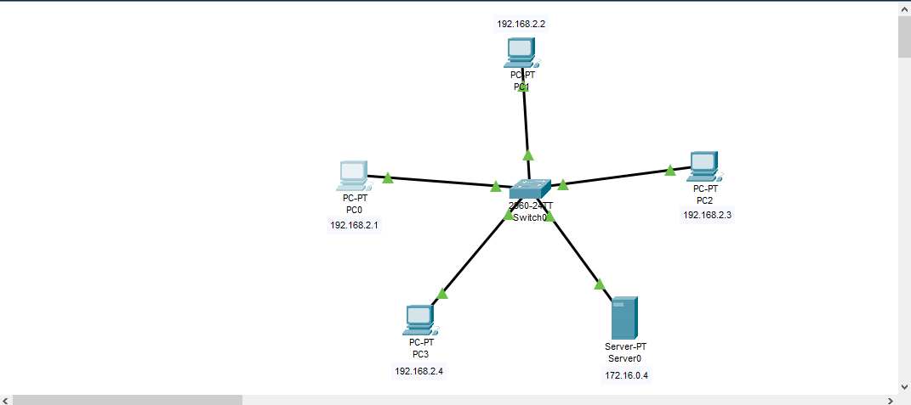
- **IP Address Table:**
  | Device  | IPv4 Address    | IPv6 Address | VLAN |
  |---------|-----------------|--------------|------|
  | PC0     | 192.168.2.1     | FD00:2::1    | 20   |
  | PC1     | 192.168.2.2     | FD00:2::2    | 20   |
  | PC2     | 192.168.2.3     | FD00:2::3    | 20   |
  | PC3     | 192.168.2.4     | FD00:2::4    | 20   |
  | PC4     | DHCP (192.168.2.50) | DHCP     | 20   |
  | Server0 | 192.168.2.100   | FD00:2::100  | 30   |
- **Configuration Notes:**
  * All devices connected to a central switch using Copper Straight-Through cables.
  * Server configured with DHCP, DNS, and HTTP services.
  * Four PCs with static IPs, one PC with DHCP.
 
  * 
- **Testing & Verification:**

- 
  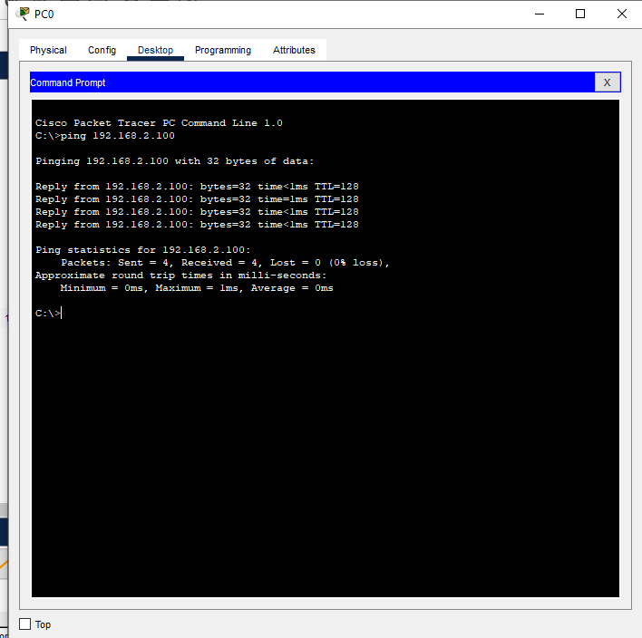
  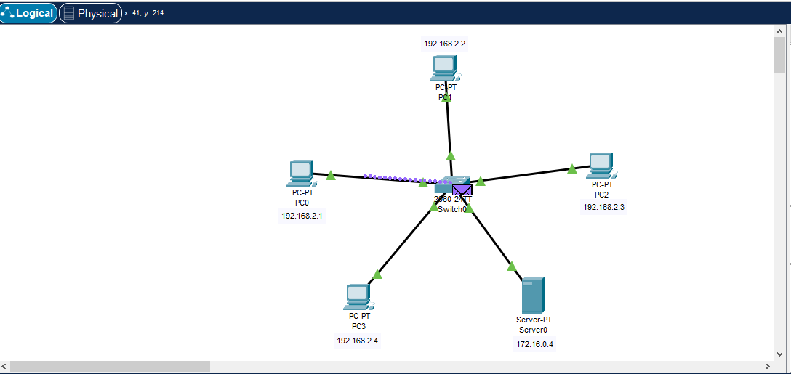
  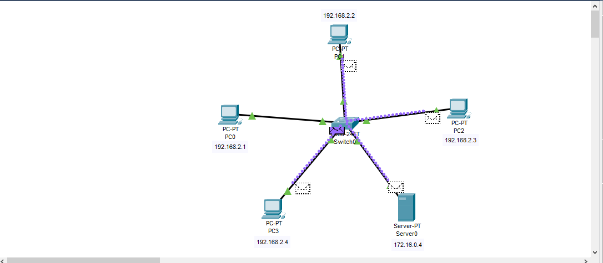
  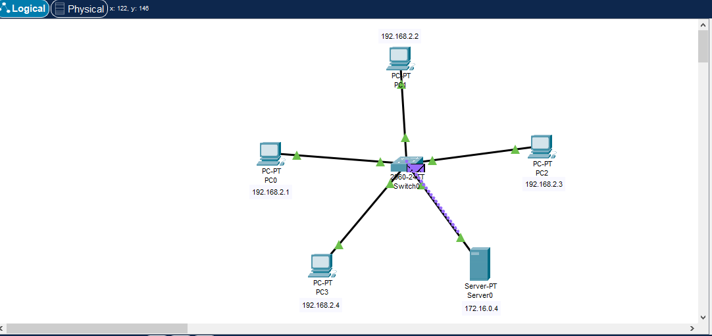
  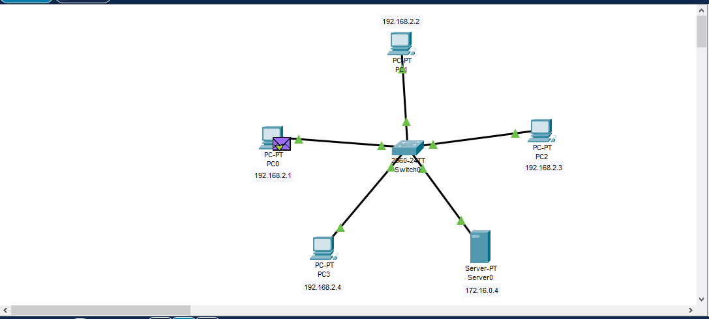
  
  > Ping and web browsing tests successful from all PCs to server.
  

  ### 3. Ring Topology

- **Objective:** To simulate a ring network where switches are connected in a circular formation, creating a logical ring.
- **Devices Used:** 4 Switches (2960), 4 PCs, 1 Server, Copper Straight-Through cables.
- **Screenshot:**
  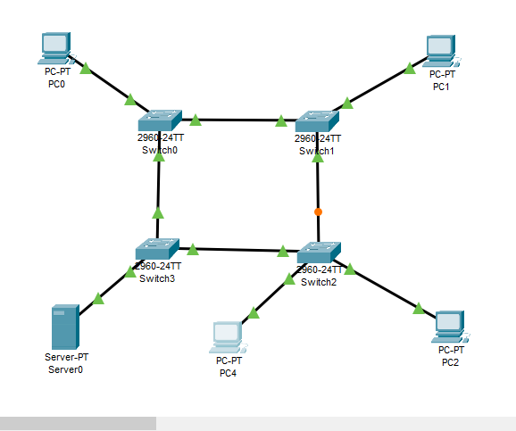
- **IP Address Table:**
  | Device  | IPv4 Address    | IPv6 Address | VLAN | Connected To |
  |---------|-----------------|--------------|------|--------------|
  | PC1     | 192.168.3.1     | FD00:3::1    | 20   | Switch1      |
  | PC2     | 192.168.3.2     | FD00:3::2    | 20   | Switch2      |
  | PC3     | DHCP (192.168.3.50) | DHCP     | 20   | Switch3      |
  | PC4     | DHCP (192.168.3.51) | DHCP     | 20   | Switch3      |
  | Server0 | 192.168.3.100   | FD00:3::100  | 30   | Switch4      |
- **Switch Connections:**
  - Switch1: Port Fa0/1 → Switch2-Fa0/1, Port Fa0/2 → Switch4-Fa0/2
  - Switch2: Port Fa0/2 → Switch3-Fa0/1
  - Switch3: Port Fa0/2 → Switch4-Fa0/1
- **Configuration Notes:**
  * Four switches connected in a ring formation using Copper Straight-Through cables.
  * Spanning Tree Protocol (STP) automatically activated to prevent network loops.
  * Server configured with DHCP, DNS, and HTTP services for the 192.168.3.0/24 network.
  * Mixed static and DHCP IP assignment for end devices.
- **Testing & Verification:**

  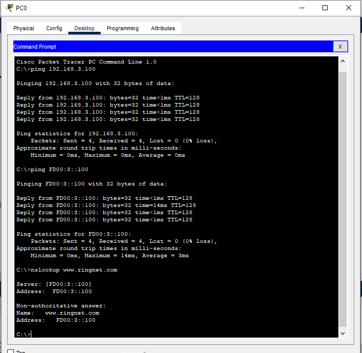
  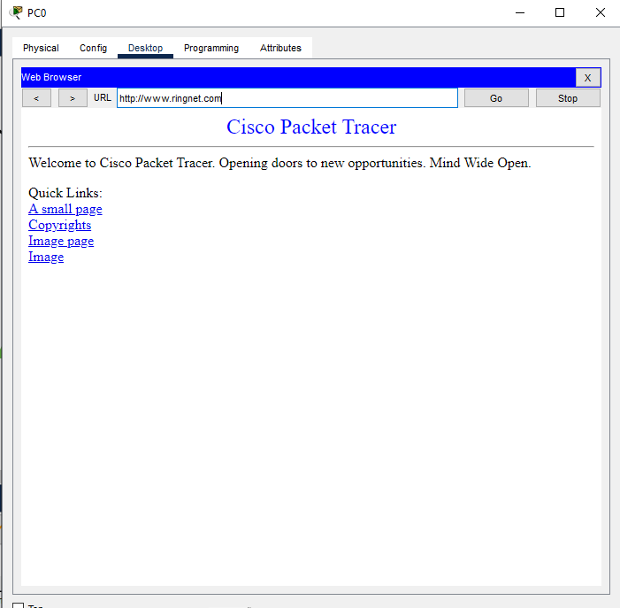
  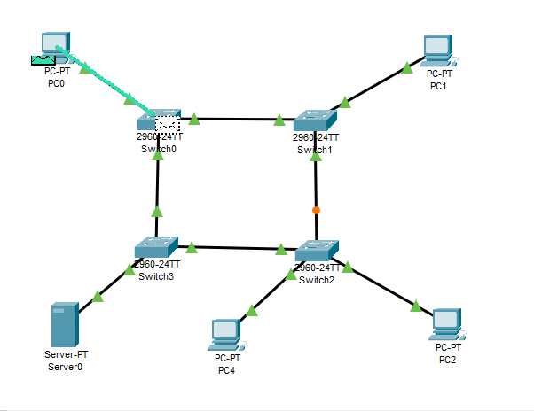
  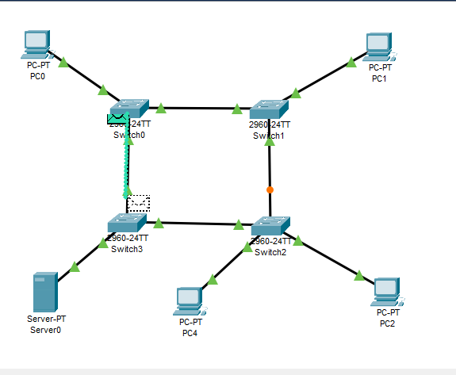
  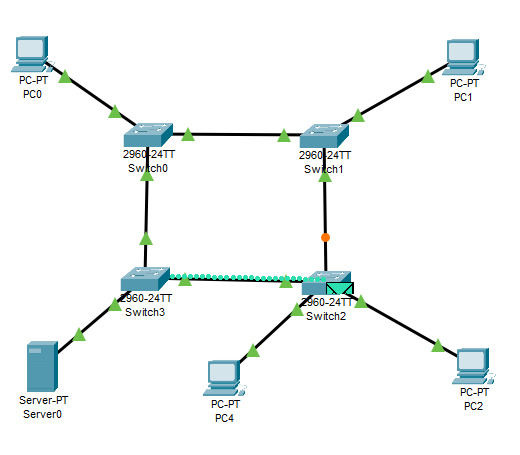
  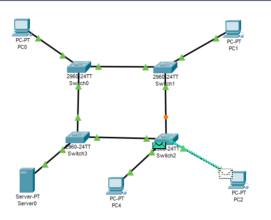
  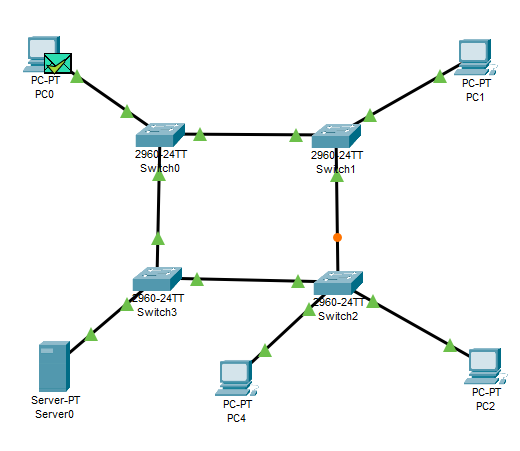
  > All devices successfully communicated across the ring. Ping tests and web browsing functional between all PCs and server.
  

  ### 4. Mesh Topology

- **Objective:** To simulate a mesh network where each switch connects to every other switch, providing multiple paths and redundancy.
- **Devices Used:** 4 Switches (2960), 4 PCs, 1 Server, Copper Straight-Through cables.
- **Screenshot:**

- 
  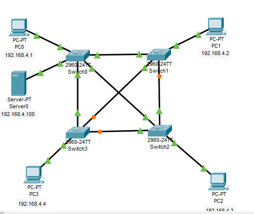
- **IP Address Table:**
  | Device  | IPv4 Address    | IPv6 Address | VLAN | Connected To |
  |---------|-----------------|--------------|------|--------------|
  | PC1     | 192.168.4.1     | FD00:4::1    | 20   | Switch1-Port Fa0/4 |
  | PC2     | 192.168.4.2     | FD00:4::2    | 20   | Switch2-Port Fa0/4 |
  | PC3     | DHCP (192.168.4.50) | DHCP     | 20   | Switch3-Port Fa0/4 |
  | PC4     | DHCP (192.168.4.51) | DHCP     | 20   | Switch4-Port Fa0/4 |
  | Server0 | 192.168.4.100   | FD00:4::100  | 30   | Switch1-Port Fa0/5 |

- **Switch Mesh Connections:**

- **Testing & Verification:**

  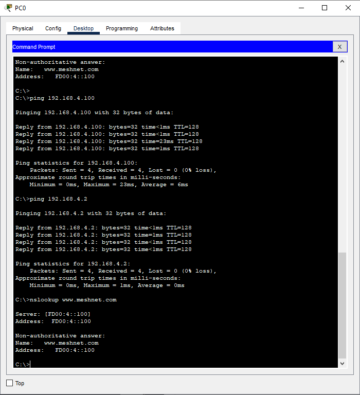
  
  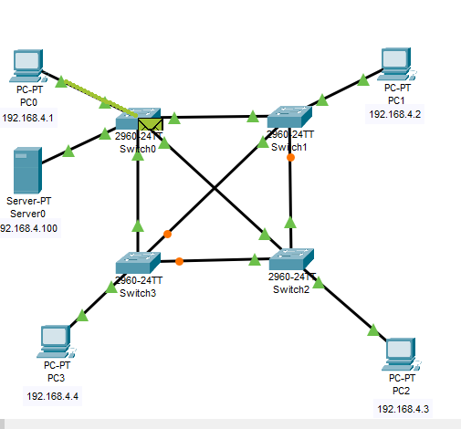
  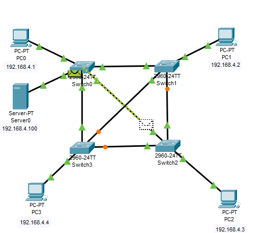
  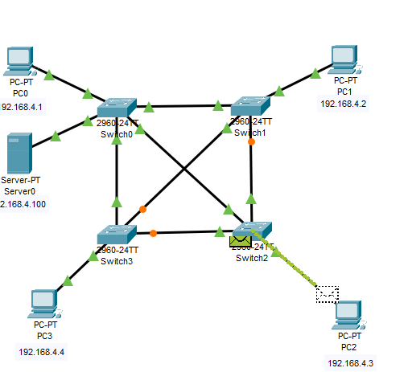
  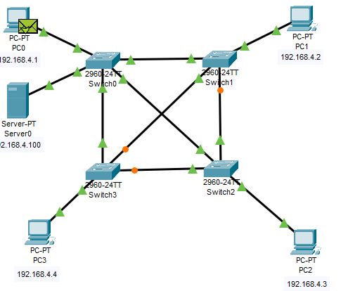

  
 
### 5. Extended Star Topology

- **Objective:** To simulate a hierarchical star network with core, distribution, and access layers, demonstrating enterprise-level network design.
- **Devices Used:** 10 Switches (1 Core, 3 Distribution, 6 Access), 12 PCs, 1 Server, Copper Straight-Through cables.
- **Screenshot:**
  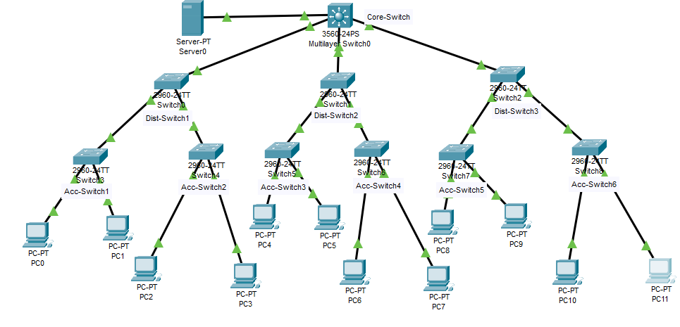
- **IP Address Table (Selected Devices):**
  | Device  | IPv4 Address    | IPv6 Address | VLAN | Hierarchical Path |
  |---------|-----------------|--------------|------|-------------------|
  | PC1     | 192.168.5.1     | FD00:5::1    | 20   | Acc-Switch1 → Dist-Switch1 → Core |
  | PC2     | DHCP (192.168.5.50) | DHCP     | 20   | Acc-Switch1 → Dist-Switch1 → Core |
  | PC12    | DHCP (192.168.5.55) | DHCP     | 20   | Acc-Switch6 → Dist-Switch3 → Core |
  | Server0 | 192.168.5.100   | FD00:5::100  | 30   | Core-Switch |

- **Hierarchical Structure:**

- **Testing & Verification:**

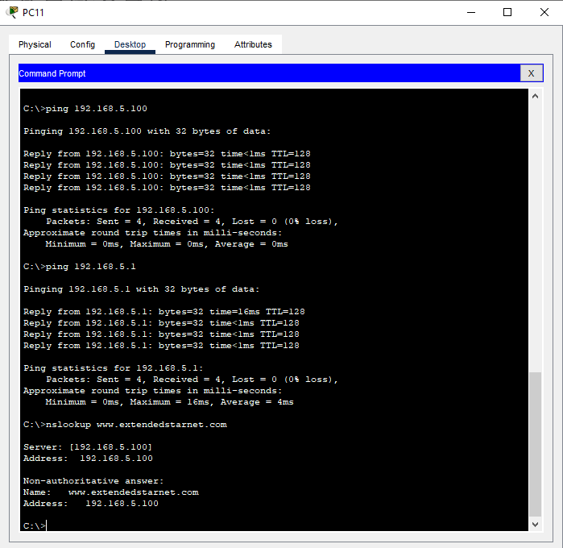
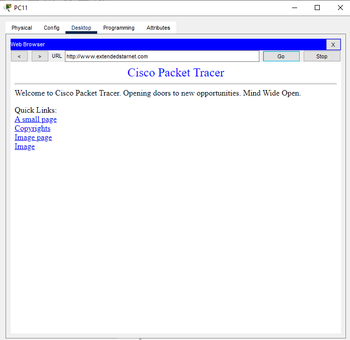
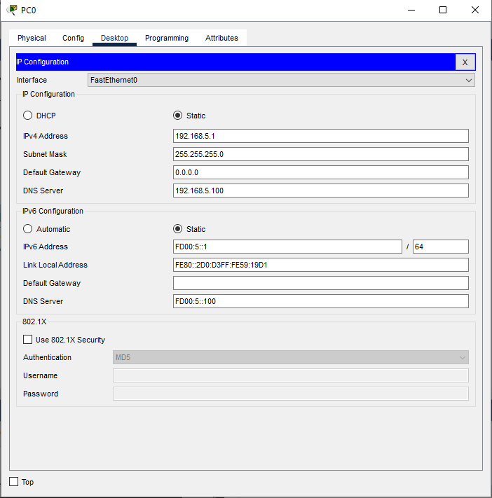
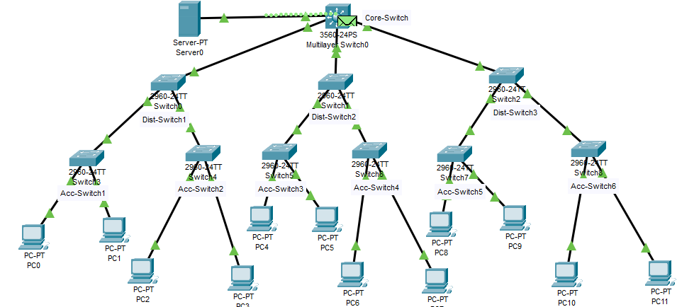
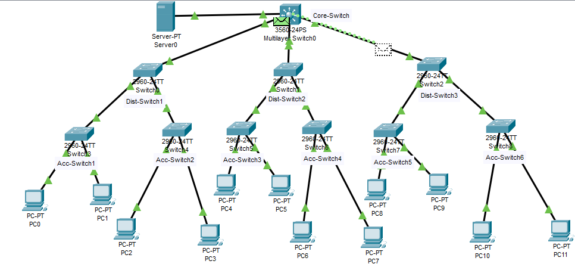
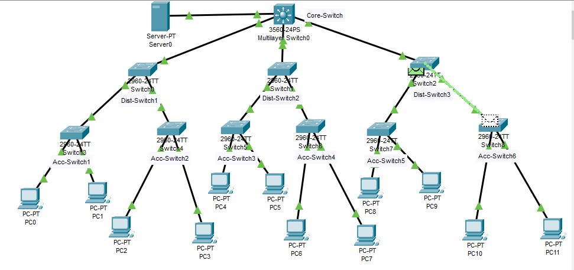
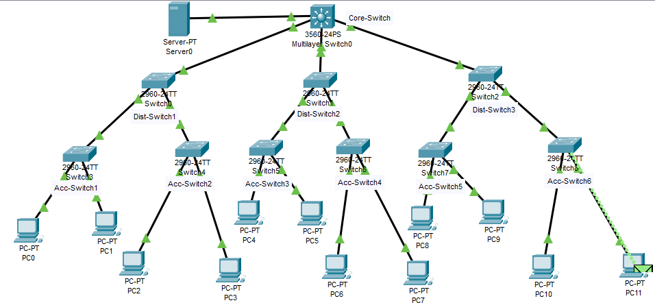
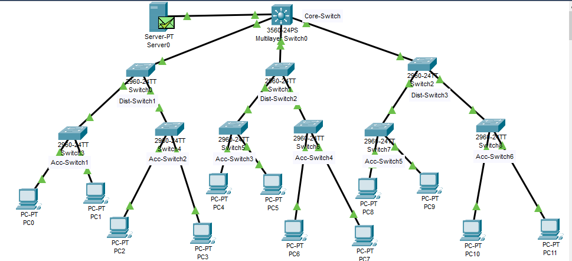
*(Sections for Star, Ring, Mesh, Extended Star, and Hybrid will be placed here following the same format)*

---

## Individual Feature: IPv6 Firewall Configuration
*(This section will be filled in during Part II)*

## Video Demonstration
*(This section will be filled in during Part III)*

## References & Tools
-   **Cisco Packet Tracer**
-   GitHub Guides
